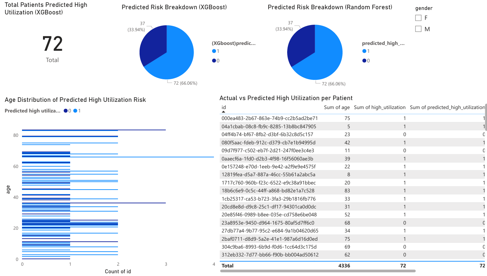

# HealthGuardian360
Real-Time Patient Risk Prediction &amp; Resource Optimization Platform
# 🩺 HealthGuardian360 – Predictive Healthcare Utilization Analytics

---

## 📘 Project Overview

**HealthGuardian360** is an end-to-end machine learning pipeline and interactive dashboard designed to help healthcare organizations **predict which patients are likely to have high utilization of services** in the next 12 months. 

This project demonstrates **real-world data engineering, feature engineering, model comparison, and business intelligence visualization** using synthetic healthcare data.

---

## 🎯 Objectives

- Forecast high healthcare utilization based on patient demographics and historical encounters.
- Compare multiple machine learning algorithms (Logistic Regression, Random Forest, XGBoost).
- Build an interactive Power BI dashboard for non-technical stakeholders.
- Provide clear insights to help healthcare providers plan resources proactively.

---

## 🛠️ Technologies Used

- **Python**
  - pandas
  - scikit-learn
  - XGBoost
- **PostgreSQL** – for data storage
- **Power BI** – interactive dashboard
- **Jupyter Notebook** – data exploration and modeling
- **Streamlit (optional future enhancement)** – for live prediction apps

---

## 🗂️ Folder Structure

HealthGuardian360/
├── data/
│   ├── sample_predictions.csv
│   └── README_data.txt                  # Instructions to download the full dataset
│
├── ingestion/
│   └── load_data.py
│
├── modeling/
│   └── model_training.ipynb
│
├── dashboards/
│   └── HealthGuardian_Dashboard.pbix
│
├── notebooks/
│   └── data_exploration.ipynb
│
├── utils/
│   └── helper_functions.py
│
├── Dashboard.png                        # Screenshot of the Power BI dashboard
├── requirements.txt                     # Python dependencies
└── README.md                            # Project documentation

---

## 🧩 Project Workflow

### 1️⃣ Data Ingestion
- Downloaded synthetic patient, encounters, and conditions datasets.
- Loaded into **PostgreSQL**.
- Cleaned data:
  - Handled missing values.
  - Standardized columns.

### 2️⃣ Feature Engineering
- Created:
  - **Age**
  - **Encounters in last 12 months**
- Defined **target variable:**
  - `1` if >1 encounter in past year.
  - `0` otherwise.

### 3️⃣ Modeling
- Split into training and test datasets.
- Trained and evaluated:
  - Logistic Regression
  - Random Forest
  - XGBoost
- Compared model accuracy and F1 scores.

### 4️⃣ Prediction
- Generated predictions for all patients.
- Saved results to CSV for visualization.

### 5️⃣ Visualization
- Built **Power BI Dashboard** with:
  - KPI card showing total predicted high-risk patients.
  - Clustered bar chart (age vs predicted risk).
  - Pie charts comparing models.
  - Table showing actual vs predicted.
  - Gender slicer filter.

---

## 📈 Model Performance

| Model               | Accuracy |
|---------------------|----------|
| Logistic Regression | ~87%     |
| Random Forest       | ~90%     |
| **XGBoost**         | **~92%** |

✅ **XGBoost** selected as the primary model for predictions.

---

## 🖥️ Power BI Dashboard Preview

> 🎯 **Note:**  
> You can **view the interactive dashboard online** here:  
> [🔗 **View Power BI Dashboard**](http://bit.ly/4eN8Ps6)

Or download the `.pbix` file from `/dashboards`.

## 🗂️ How to Run This Project

**1️⃣ Clone the repository**
git clone https://github.com/Akashnaireruvattu0611/HealthGuardian360.git

**2️⃣ Create virtual environment & install dependencies**
pip install -r requirements.txt

**3️⃣ Load sample data into PostgreSQL**
- Run `load_data.py`

**4️⃣ Train models**
- Run `model_training.ipynb`

**5️⃣ Generate predictions**
- Save `sample_predictions.csv`

**6️⃣ Visualize**
- Open `HealthGuardian_Dashboard.pbix` in Power BI Desktop.

---

## 💡 Future Enhancements

- Add chronic conditions and comorbidity scores as features.
- Integrate SHAP for model explainability.
- Deploy a **Streamlit app** for real-time predictions.
- Automate daily refreshes in Power BI Service.

---

## 📬 Contact

Created by **Akash Nair Eruvattu**  
🌐 [https://www.linkedin.com/in/akashnaireruvattu/](https://www.linkedin.com/in/akashnaireruvattu/)  
📧 akashnaireruvattu2001@gmail.com

---

> **Disclaimer:** This project uses synthetic data generated by Synthea. No real patient data is used.
